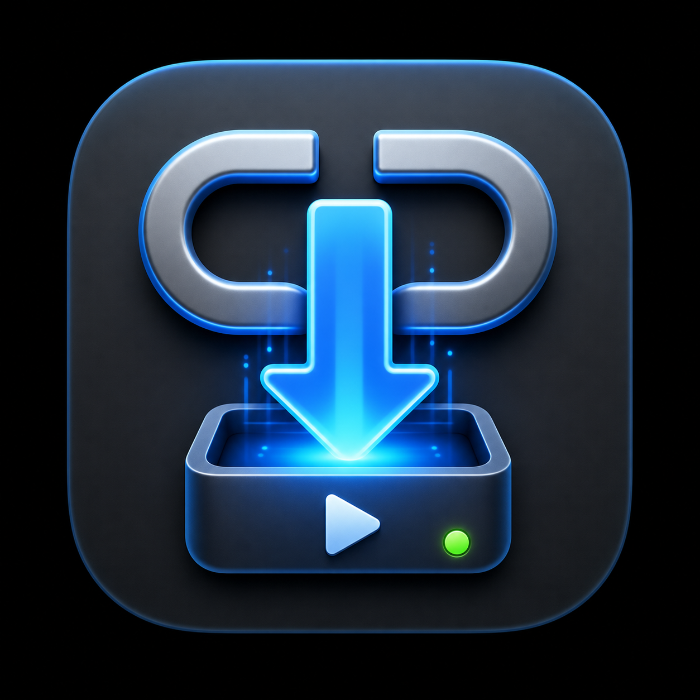

<p align="center">
  
</p>

# CueFetch

CueFetch is a native macOS preflight app for `yt-dlp`. Paste a media URL, inspect
the detected title, thumbnail, formats, subtitles, access state, destination, and
exact command, then download with confidence.

It is built for people who trust `yt-dlp` but do not want every download to begin
in Terminal: creators, editors, researchers, ministry teams, archivists, and
anyone who needs a calmer review step before saving media locally.

## Why CueFetch

Most downloader front-ends either expose too little before download or grow into
large queue managers. CueFetch focuses on one careful workflow:

1. Paste a link.
2. Analyze it with the user's local `yt-dlp`.
3. Review metadata, formats, subtitles, and access warnings.
4. Choose a destination and output preset.
5. Run the visible command.

The goal is not to replace `yt-dlp`. The goal is to make the important decision
points visible before anything lands on disk.

## Features

- Native SwiftUI/AppKit macOS app
- Real `yt-dlp` JSON analysis before download
- Format review for video, audio, subtitles, estimated size, and compatibility
- Presets for best video, 1080p MP4, audio-only, and custom format selection
- Destination folder picker with Finder reveal after download
- Optional Safari cookie handoff through `yt-dlp` for authorized access
- Live progress parsing, cancellation, and readable failure states
- Local tool detection for `yt-dlp` and FFmpeg
- Command preview so users can see what CueFetch will run

## Requirements

- macOS 14 or newer
- Xcode command line tools or Xcode
- `yt-dlp` installed on the user's PATH
- FFmpeg recommended for merging/remuxing formats

Install the tools with Homebrew:

```bash
brew install yt-dlp ffmpeg
```

## Run From Source

```bash
git clone https://github.com/TheoPsycheMedia/CueFetch.git
cd CueFetch
./script/build_and_run.sh
```

Run verification:

```bash
swift test
./script/build_and_run.sh --verify
```

Build a local DMG:

```bash
./script/build_and_run.sh --dmg
```

## Current Status

CueFetch is an early preview. The core workflow is working locally, but public
release packaging, signing, notarization, and broader QA are still future work.
Expect sharp edges while the app is young.

## Legal And Responsible Use

CueFetch is an independent wrapper that invokes external tools installed on the
user's Mac. It does not vendor, fork, modify, or redistribute `yt-dlp` or FFmpeg.

- `yt-dlp` is released under the Unlicense.
- FFmpeg is licensed primarily under LGPL v2.1+, with optional GPL components
  depending on build configuration.
- CueFetch is not affiliated with `yt-dlp`, FFmpeg, YouTube, Vimeo, TikTok, X, or
  any other supported site.

Users are responsible for complying with copyright law, platform terms, and their
own access rights. CueFetch is intended for media the user is authorized to
download, archive, or transform. CueFetch does not bypass DRM.

See [THIRD_PARTY_NOTICES.md](THIRD_PARTY_NOTICES.md) and [NOTICE](NOTICE) for
third-party attribution.

## Similar Projects

The `yt-dlp` ecosystem already has capable front-ends, including Open Video
Downloader, MacYTDL, Parabolic, Seal, and YTDLnis. CueFetch's lane is narrower:
a Mac-native, review-before-download workflow with a visible command surface.

## License

CueFetch is licensed under the [Apache License 2.0](LICENSE).
