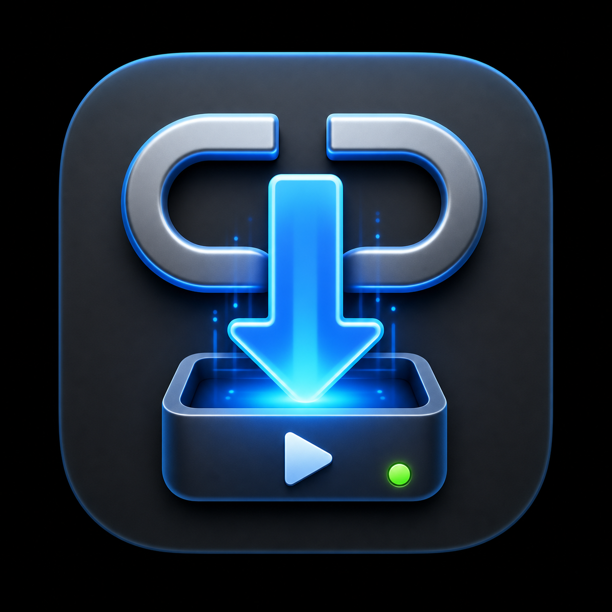

<p align="center">
  
</p>

# CueFetch

CueFetch is a native macOS preflight app for `yt-dlp`. Paste an HTTP(S) media
URL, inspect the detected title, formats, subtitles, access state, destination,
and effective command, then download with confidence.

The product has one lane: make the important decisions visible before a local
download starts. It is not intended to become a browser, media library, or
large queue manager.

## Status

`0.2.0-preview` is the current public prerelease. The downloadable DMG is
ad-hoc signed and is not notarized by Apple, so verify its attached SHA-256
checksum and expect macOS to require an explicit trust decision before opening
it. Developer ID signing and notarization remain requirements for a stable
distribution. Preview builds should be treated as early software.

## Workflow

1. Paste one HTTP(S) media link.
2. Analyze it with the user's installed `yt-dlp`.
3. Review real metadata, formats, subtitles, access warnings, and local tools.
4. Choose a destination and output preset.
5. Run the exact validated plan shown by CueFetch.
6. Inspect the completion receipt and reveal the resulting file in Finder.

CueFetch rejects option-like or malformed input, prevents a single-item review
from silently expanding into a playlist, ignores ambient `yt-dlp`
configuration, and terminates command options before passing the URL.

## Features

- Native SwiftUI and AppKit macOS interface
- Recommendation-first Liquid Orbit workflow with native macOS 26 Liquid Glass
  and adaptive material fallbacks on macOS 14 and later
- Real `yt-dlp` JSON analysis before download
- Review of formats, subtitles, output compatibility, and local tool readiness
- Presets for best video, 1080p MP4, audio-only, and explicit format selection
- User-selected destination with Finder reveal
- Per-job Safari cookie access for media the user is authorized to access
- Structured running, succeeded, failed, and cancelled states
- Live progress, cancellation, and readable recovery guidance
- Session-only recent links and redacted completion receipts
- Visible effective arguments before execution
- General-purpose Editing, Audio, Archive, and Short Clips workflows

## Requirements

- macOS 14 or newer
- Apple silicon (`arm64`) or Intel (`x86_64`) Mac
- `yt-dlp` installed locally
- FFmpeg required by the standard video and audio presets and any selected
  format that needs merging; direct progressive custom formats do not use it
- Xcode command line tools or Xcode when building from source

Install the external tools with Homebrew:

```bash
brew install yt-dlp ffmpeg
```

CueFetch invokes these tools; it does not vendor or update them.

## Install And Update

When preview DMGs are published, they appear on the
[GitHub Releases page](https://github.com/TheoPsycheMedia/CueFetch/releases).
Check the specific release note for its signing and notarization status, then
verify the downloaded checksum before opening it:

```bash
shasum -a 256 -c CueFetch-0.2.0-preview.dmg.sha256
```

CueFetch does not currently self-update. To update the app, download the newer
DMG, quit CueFetch, and replace the copy in `/Applications`. Update `yt-dlp` and
FFmpeg separately through the package manager that installed them; with
Homebrew, use `brew upgrade yt-dlp ffmpeg`.

## Run From Source

```bash
git clone https://github.com/TheoPsycheMedia/CueFetch.git
cd CueFetch
./script/build_and_run.sh
```

Run focused verification:

```bash
swift test
swift build --configuration release
./script/build_and_run.sh --verify
```

`--verify` launches a locally built app and therefore requires a graphical
macOS session. CI runs tests, coverage reporting, a release build, and universal
DMG packaging on every pull request and push to `main`; CueFetchCore line
coverage must remain at or above 80%.

## Release Packaging

Build an ad-hoc-signed universal DMG:

```bash
./script/build_and_run.sh --dmg
```

The release mode refuses a dirty worktree, runs the test suite, verifies both
architectures, validates the app signature strictly, includes the license and
notices in both the app and DMG, and writes a SHA-256 file plus factual release
notes under `dist/`.

Developer ID signing and notarization are opt-in. They require a certificate in
the local Keychain and a `notarytool` Keychain profile; no Apple credentials are
stored in this repository or passed as command-line secrets:

```bash
CUEFETCH_SIGN_IDENTITY="Developer ID Application: Your Name (TEAMID)" \
CUEFETCH_NOTARY_PROFILE="CueFetch-notary" \
./script/build_and_run.sh --notarize
```

See [docs/RELEASING.md](docs/RELEASING.md) for the full checklist. A successful
local package does not enable GitHub branch protection, private vulnerability
reporting, Apple certificates, or notarization credentials; those remain
external maintainer gates.

## Local Data And Privacy

CueFetch is a single-user local app. Download preferences are stored in macOS
`UserDefaults`. Recent links, including the full URL needed to reselect one, stay
in memory for the current app session only; they are not persisted, and legacy
persisted link history is removed at launch. Completion receipts remove URL user
information and fragments, replace query values, abbreviate paths under the home
folder, and never include browser cookie values.

Safari cookie access is off by default and scoped to the job where the user
explicitly enables it. CueFetch never reads or stores cookie values itself; it
asks the local `yt-dlp` process to access Safari's cookie store. Tool processes
receive a constrained environment rather than the app's complete inherited
environment.

Downloaded media and its filesystem metadata remain in the destination the
user chose. Anyone with access to the Mac account, its backups, clipboard, or
download destination may still see local data, so private media should be
handled according to the Mac's own account and disk security.

See [SECURITY.md](SECURITY.md) and
[docs/SECURITY-DESIGN.md](docs/SECURITY-DESIGN.md) for reporting and trust
boundaries.

## Project Documentation

- [Architecture](docs/ARCHITECTURE.md)
- [Roadmap](docs/ROADMAP.md)
- [Release process](docs/RELEASING.md)
- [Security design](docs/SECURITY-DESIGN.md)
- [Contributing](CONTRIBUTING.md)

## Legal And Responsible Use

CueFetch is an independent wrapper around tools installed by the user. It is
not affiliated with `yt-dlp`, FFmpeg, YouTube, Vimeo, TikTok, X, or any other
supported site. CueFetch does not bypass DRM.

Users are responsible for complying with copyright law, platform terms, and
their own access rights. Use CueFetch only for media you are authorized to
download, archive, or transform.

See [THIRD_PARTY_NOTICES.md](THIRD_PARTY_NOTICES.md) and [NOTICE](NOTICE) for
third-party attribution. CueFetch is licensed under the
[Apache License 2.0](LICENSE).
