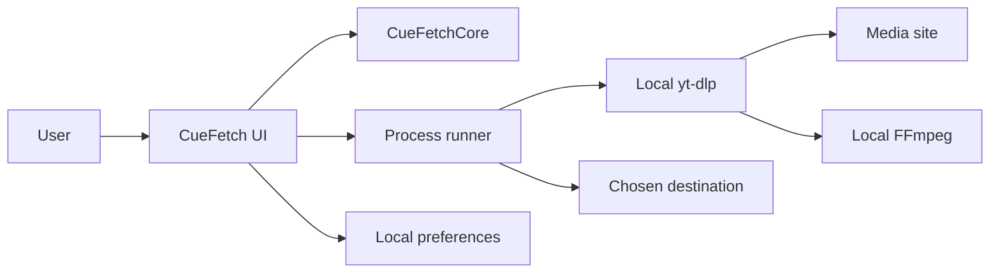

# CueFetch Architecture

## Product Boundary

CueFetch is a single-user native macOS application. It provides a review and
execution layer around external `yt-dlp` and FFmpeg binaries installed by the
user. It has no server, user accounts, browser extension, cloud database, or
background download service.

## Targets

### `CueFetchCore`

Dependency-light domain logic that can be tested without launching AppKit:

- URL intake and single-item policy
- `yt-dlp` metadata decoding and format mapping
- validated command construction
- download-plan, format, compatibility, and tool-status models
- error classification and recovery semantics

Core types should not access `UserDefaults`, the clipboard, AppKit dialogs, or
the network directly.

### `CueFetch`

The macOS executable target owns SwiftUI/AppKit presentation and host integration:

- window and menu lifecycle
- the preflight, format, destination, and settings views
- preference persistence and session-only recent links
- Core-backed local tool discovery
- run-state/completion models plus process execution, cancellation, progress,
  and output-file resolution
- Finder and clipboard actions

The store coordinates the workflow, while process adapters isolate Foundation's
`Process` API so lifecycle behavior can be tested deterministically.

### External tools

CueFetch resolves and invokes the user's installed `yt-dlp`; `yt-dlp` may invoke
FFmpeg. CueFetch does not vendor either binary. A compromised local executable is
outside the app's integrity boundary, so executable discovery and the constrained
subprocess environment remain security-sensitive.

## Runtime Flow

1. Intake validates one HTTP(S) URL with a host and resolves playlist ambiguity.
2. Analysis invokes `yt-dlp` for machine-readable metadata without downloading.
3. Mapping exposes only real detected formats and access/tool warnings; Best
   Video ranks pixel resolution before compatibility tie-breakers.
4. User choices produce one immutable effective download plan.
5. The command preview and runner consume that same plan.
6. A run ends as succeeded, failed, or cancelled; only a zero exit with the
   exact final-path marker and an existing non-directory output creates a
   completion record tied to that run.
7. Persistence stores preferences, not recent URLs or cookies. Recent links stay
   in memory for the current session, and receipts redact URL query values.

## Build And Release Boundary

Swift Package Manager builds the source. `script/build_and_run.sh` assembles the
`.app`, creates separate `arm64` and `x86_64` release binaries, combines them with
`lipo`, copies legal notices, signs and verifies the bundle, and packages the DMG.

GitHub Actions runs tests, coverage, a release build, and ad-hoc-signed universal
packaging without secrets. Developer ID signing, Apple notarization, GitHub
protected-branch settings, and public release publication remain explicit
maintainer actions.

## Design Rules

- The reviewed plan must be the executed plan.
- User-controlled URL data is never interpreted as a command-line option.
- Completion evidence belongs to one run and cannot inherit stale paths.
- Cancellation is not success, even if partial output exists.
- Missing metadata stays unknown; presentation must not invent detected formats.
- Sensitive input is minimized before persistence, clipboard, logs, and fixtures.
- External tools and release artifacts are verified at their actual trust boundary.
