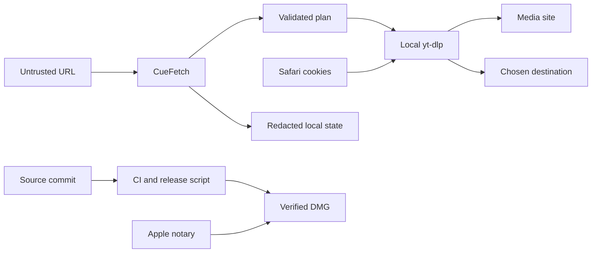

# CueFetch Security Design

## Executive Summary

CueFetch's highest-risk boundary is a pasted URL becoming arguments to an
external downloader. The implemented policy validates one HTTP(S) URL, disables
ambient `yt-dlp` configuration, separates options from the URL, and keeps the
reviewed plan identical to the executed plan. The other material risks are local
privacy leakage through history, receipts, cookies, or process environment, and
false confidence in an unsigned or tampered release artifact.

## Scope And Assumptions

In scope are the native app, `CueFetchCore`, local subprocess execution,
`UserDefaults`, receipt/clipboard behavior, and the build/release pipeline.
Media-site behavior, `yt-dlp`, FFmpeg, Safari, GitHub administration, and Apple's
notary service are external trust boundaries.

Assumptions confirmed for this design:

- CueFetch is a single-user local app, not a network service or multi-tenant tool.
- The user intentionally starts analysis and download for one supplied link.
- An attacker may control a shared URL or site response but does not already
  control the user's Mac account.
- Local `yt-dlp` and FFmpeg executables are operator-installed dependencies, not
  code distributed by CueFetch.
- Public distribution is expected through GitHub Releases, with Apple Developer
  ID signing and notarization when maintainer credentials are available.

Open external questions that affect release risk are whether GitHub private
vulnerability reporting and required CI checks are enabled, and whether the
published artifact has actually passed Apple notarization. Source code cannot
answer those questions.

## System Model

### Primary Components

- SwiftUI/AppKit UI and `DownloadStore` coordinate local user actions and state.
- `CueFetchCore` validates intake, maps metadata, and builds a download plan.
- A process runner invokes resolved local tools using argument arrays and a
  constrained environment.
- `UserDefaults`, the clipboard, and the selected destination cross from private
  app state into host-visible persistence.
- The release script and CI assemble and verify the distributed app and DMG.

### Data Flows And Trust Boundaries

- Shared URL → CueFetch: untrusted text enters through paste; no authentication;
  scheme, host, item count, and playlist ambiguity are validated before use.
- CueFetch → `yt-dlp`: arguments cross a local process boundary; options are an
  array, ambient config is ignored, and `--` terminates options before the URL.
- `yt-dlp` → media site: HTTPS and site behavior are owned by the external tool;
  CueFetch parses machine-readable metadata and process output.
- Safari → `yt-dlp`: cookies cross only for the explicitly opted-in job; CueFetch
  neither reads nor persists cookie values.
- CueFetch → local host state: preferences may enter `UserDefaults`, recent URLs
  remain session-only, and redacted data may enter a receipt; downloaded media
  enters the user-selected destination.
- Source commit → release artifact: CI and the release script test, build, sign,
  verify, package, and checksum; Developer ID, GitHub settings, and notarization
  remain external controls.

## Assets And Security Objectives

| Asset | Why it matters | Objective |
|---|---|---|
| Source URLs and query data | May reveal private media, tokens, or viewing intent | Confidentiality |
| Safari session cookies | Can grant access as the signed-in user | Confidentiality, integrity |
| Effective download plan | Must match what the user reviewed | Integrity |
| Download state and final path | Prevents false success and stale receipts | Integrity |
| Local environment and executable paths | May contain secrets or select unintended tools | Confidentiality, integrity |
| App and DMG artifacts | Users rely on them to execute local code | Integrity, authenticity |

## Attacker Model

### Capabilities

- Supply a crafted link, redirect, playlist link, or media-site response.
- Convince a user to process content that requires a signed-in browser session.
- Read public source, CI configuration, release notes, and public artifacts.
- Tamper with an artifact distributed outside the protected release channel.

### Non-Capabilities

- No unauthenticated network endpoint exists in CueFetch.
- A remote link supplier does not directly control the local process environment,
  Keychain, `UserDefaults`, filesystem, or installed tool binaries.
- The design does not claim to protect an already compromised macOS account or a
  malicious locally installed `yt-dlp`/FFmpeg executable.

## Entry Points And Attack Surfaces

| Surface | Boundary and control | Evidence |
|---|---|---|
| Pasted link | Validated HTTP(S), host, single-item policy | `Sources/CueFetchCore/Services/URLIntakeAnalyzer.swift` |
| Analysis/download arguments | Array construction, ignored config, option terminator | `Sources/CueFetchCore/Services/YTDLPCommandBuilder.swift` |
| Process execution | Resolved executable and constrained environment | `Sources/CueFetch/Stores/DownloadStore.swift`, `Sources/CueFetchCore/Services/ToolLocator.swift` |
| Recent history and receipts | Recent URLs stay session-only; receipts redact query values and home paths | `Sources/CueFetch/Stores/DownloadStore.swift`, `Sources/CueFetch/Stores/DownloadExecution.swift` |
| Safari-cookie option | Explicit per-job scope; values remain with Safari/`yt-dlp` | `Sources/CueFetch/Stores/DownloadStore.swift`, `Sources/CueFetchCore/Services/YTDLPCommandBuilder.swift` |
| Release artifacts | Clean/test gate, universal build, signing verification, checksum, optional notarization | `script/build_and_run.sh`, `.github/workflows/ci.yml` |

## Top Abuse Paths

1. An attacker supplies option-like text → app mistakes it for a URL → `yt-dlp`
   interprets it as configuration or a flag → execution differs from review.
2. An attacker supplies a playlist link → one-item preview expands at execution →
   unexpected files, requests, and disk use result.
3. A private URL enters recent history or a receipt → another local user, backup,
   or pasted message reveals query data or access tokens.
4. Cookie use persists beyond one authorized job → an unrelated later URL receives
   authenticated browser context.
5. The app inherits secrets or a hostile tool search path → a child process gains
   unnecessary data or an unintended executable runs.
6. A user downloads an unverified DMG → a replacement artifact runs under the
   CueFetch name → local code execution and data exposure follow.

## Threat Model

| ID | Threat action | Existing controls | Residual gap | Priority |
|---|---|---|---|---|
| TM-001 | Crafted input becomes a `yt-dlp` option or ambient config changes behavior | HTTP(S)+host validation, one-link policy, `--ignore-config`, `--` before URL, argument arrays | `yt-dlp` and site parsers still process attacker-influenced network data | High likelihood without controls; high impact; **high** |
| TM-002 | Reviewed item expands into a playlist or executed format diverges from preview | Explicit playlist handling and one immutable effective plan shared by preview and runner | Future options must continue to flow only through the plan | Medium likelihood; medium impact; **medium** |
| TM-003 | Private URL, token, path, or cookie context leaks through persistence, receipts, or clipboard | Recent URLs are session-only; receipts redact URL query values and abbreviate home paths; cookies are not read/stored; per-job opt-in | In-memory history, destination files, clipboard contents, and macOS backups remain host-visible | Medium likelihood; high impact for private media; **high** |
| TM-004 | Inherited environment or tool substitution exposes secrets or runs unintended code | Resolved executable path and allowlisted process environment | A compromised installed binary or Mac account remains trusted local state | Low likelihood for remote attacker; high impact; **medium** |
| TM-005 | Tampered or mislabeled release artifact is installed | Clean/test gate, dual-architecture verification, strict code-sign verification, legal manifest, SHA-256; optional Developer ID and notarization | GitHub protection, certificate custody, publication, and Apple acceptance are external | Medium likelihood outside official channel; high impact; **high** |

Priority calibration for this local app: **critical** means reliable remote code
execution without a deliberate local operation or compromise of signing keys;
**high** means realistic command-plan manipulation, cookie/private-link exposure,
or a tampered public artifact; **medium** means meaningful harm requiring local
tool/account compromise or additional user action; **low** means limited
non-sensitive disclosure or easily reversible local disruption.

## Mitigations And Detection

- Keep URL and command-policy tests as merge gates, including option-like input,
  playlists, cookies, cancellation, and stale completion data.
- Never interpolate a shell command; execute a resolved binary with an argument
  array and an allowlisted environment.
- Treat persistence, logs, fixtures, receipts, screenshots, and clipboard output
  as separate disclosure sinks and test their redaction.
- Record tool versions and the final machine-readable output path for diagnosis,
  but omit source query data and environment values.
- Publish the final DMG, matching checksum, and factual signing/notarization state
  together. Never replace an artifact under an existing version.
- Verify GitHub required checks/private reporting and Apple Gatekeeper/notary state
  on their live surfaces before calling the release protected or notarized.

## Focus Paths For Security Review

| Path | Reason | Threats |
|---|---|---|
| `Sources/CueFetchCore/Services/URLIntakeAnalyzer.swift` | Untrusted-input normalization and item scope | TM-001, TM-002 |
| `Sources/CueFetchCore/Services/YTDLPCommandBuilder.swift` | Security boundary from plan to process arguments | TM-001, TM-002, TM-003 |
| `Sources/CueFetch/Stores/DownloadStore.swift` | Process lifecycle, cookies, persistence, receipt, final path | TM-002, TM-003, TM-004 |
| `Sources/CueFetchCore/Services/ToolLocator.swift` | Executable discovery and child environment | TM-004 |
| `script/build_and_run.sh` | Signing, notarization, packaging, and checksums | TM-005 |
| `.github/workflows/ci.yml` | Automated tests and artifact validation without secrets | TM-005 |

## Quality Check

- Pasted input, subprocesses, persistence/clipboard, cookies, files, and release
  artifacts are represented.
- Runtime controls are separated from CI, GitHub administration, and Apple gates.
- Risks are calibrated for a deliberate local app, not an internet service.
- Unknown live GitHub and Apple state is named rather than assumed.
